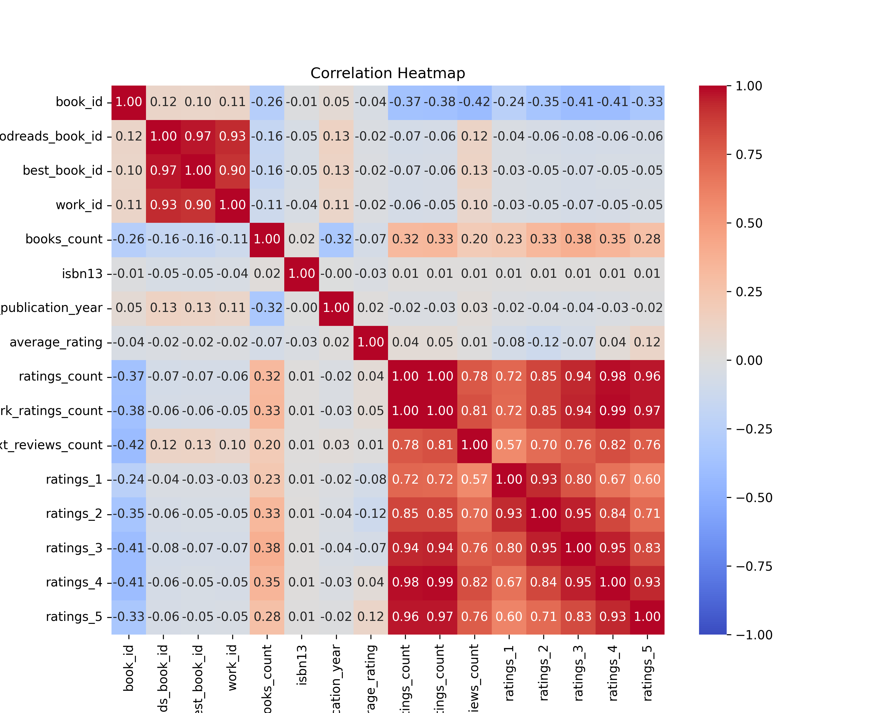

# Dataset Analysis

## Data Overview
Dataset contains 10000 rows and 23 columns.
## Insights
Analyzing the dataset provided, we can derive several insights based on the columns and their types. Here are some observations concerning potential trends, anomalies, and key findings:

### Columns Overview

1. **Identifiers and Counts:**
   - `book_id`, `goodreads_book_id`, `best_book_id`, and `work_id` are integer identifiers for unique books or works. They are crucial for linking and referencing the data.
   - `books_count` indicates the number of books associated with each work, potentially indicating series or compilations.

2. **ISBN and Identifiers:**
   - `isbn` is a string representation of the book's standard number format, essential for identifying books in a library or bookstore.
   - `isbn13`, currently stored as `float64`, may imply that some ISBNs are missing, as integers or strings are typically used for these values. The use of float may cause complications during data processing, especially if there are unique identifiers.

3. **Authors and Titles:**
   - `authors`, `original_title`, and `title` are string fields that provide textual data about the book. The presence of multiple authors could indicate collaborative works or anthologies.

4. **Publication Information:**
   - `original_publication_year`, recorded as `float64`, hints at the possibility of non-integer years; this may introduce errors or anomalies in data analysis. Years should ideally be in integer format.

5. **Ratings and Reviews:**
   -

## Visualizations

