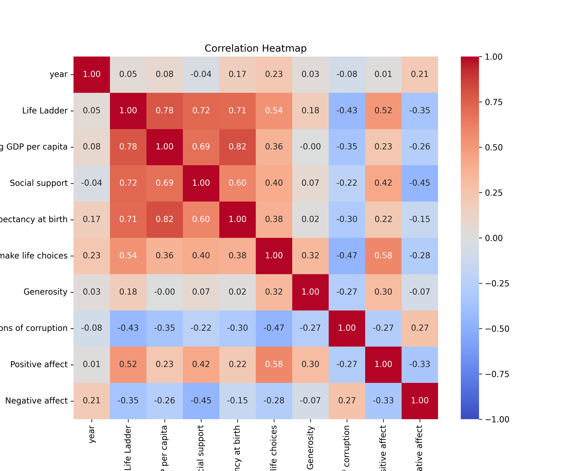

# Dataset Analysis

## Data Overview
Dataset contains 2363 rows and 11 columns.
## Insights
To analyze the provided dataset, we will focus on the following aspects based on the columns and their respective types:

### Dataset Overview
The dataset includes a variety of socio-economic indicators across different countries and years. The columns appear to be metrics associated with well-being and quality of life, as measured by the "Life Ladder," which is often used to gauge subjective well-being. Here's a closer look at the columns:

1. **Country Name (object)**: Represents country identification.
2. **Year (int64)**: Intervals of time measured within the dataset.
3. **Life Ladder (float64)**: Subjective measurement of well-being or happiness.
4. **Log GDP per capita (float64)**: Economic metric indicating wealth.
5. **Social Support (float64)**: Measurement of societal well-being and the support structures available.
6. **Healthy Life Expectancy at Birth (float64)**: Indicator of health outcomes in populations.
7. **Freedom to Make Life Choices (float64)**: Measures personal freedoms individuals feel they have.
8. **Generosity (float64)**: Reflects altruistic behavior in populations.
9. **Perceptions of Corruption (float64)**: Indicates the degree of perceived corruption within countries.
10. **Positive Affect (float64)**: Measures the frequency of experiencing positive emotions.
11. **Negative Affect (float64)**: Measures the frequency of experiencing negative emotions.

### Insights Analysis

#### Trends
1. **Yearly

## Visualizations

