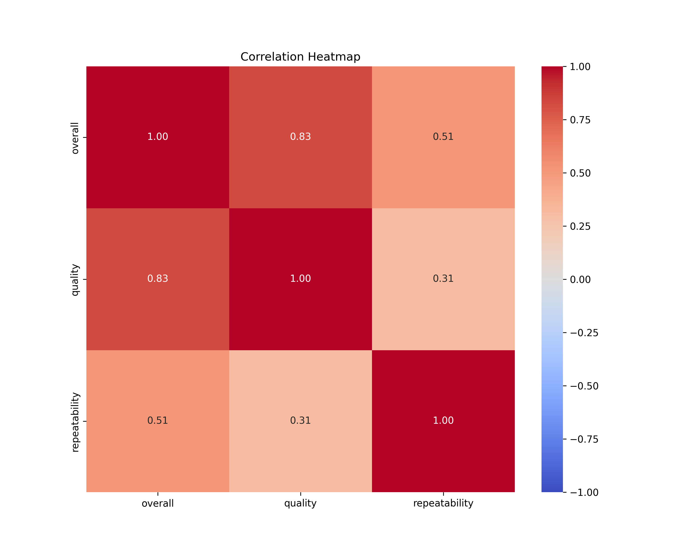

# Data Analysis Report

Dataset contains 2652 rows and 8 columns.
## Insights
Based on the dataset's column names and their corresponding data types, we can derive the following insights and potential areas for analysis regarding trends and anomalies.

### Dataset Overview
1. **date (object)**: This column likely contains date values, but since it's of type `object`, it may require conversion to a datetime format for proper time series analysis.
   
2. **language (object)**: Indicates the language of the data entries. This opens up the opportunity for language-based trend analysis.

3. **type (object)**: This column likely categorizes the entries into various types. Analyzing the distribution of types could reveal which types are more prevalent or what categories have outlier trends.

4. **title (object)**: The title field may contain descriptive text that could be analyzed for common themes or keywords.

5. **by (object)**: This may denote the author or source of the entries, allowing for an analysis of contributions over time.

6. **overall (int64)**: This metric could represent an aggregated score or rating of the entries. It can be analyzed for overall performance and trends over time.

7. **quality (int64)**: Presumably measures the quality of the entries, which could correlate with other factors like type or source.

8. **repeatability (int64)**: This might gauge the consistency or ability to replicate results. Analyzing this in conjunction with other columns may highlight trends in reliability or quality over time.

### Insights and Analysis Directions

## Visualizations

